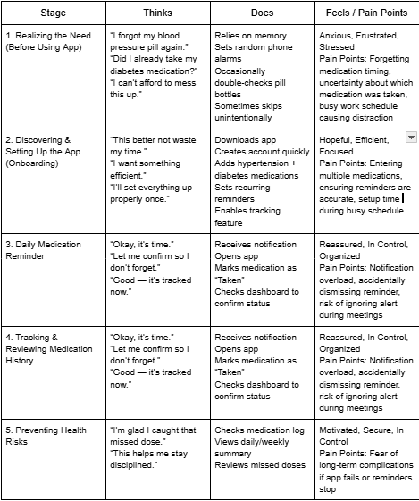
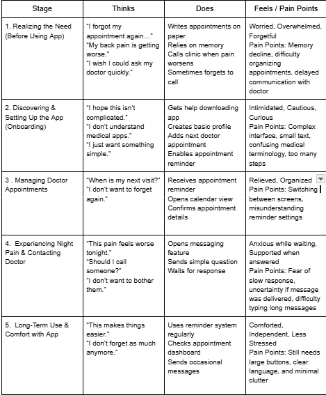
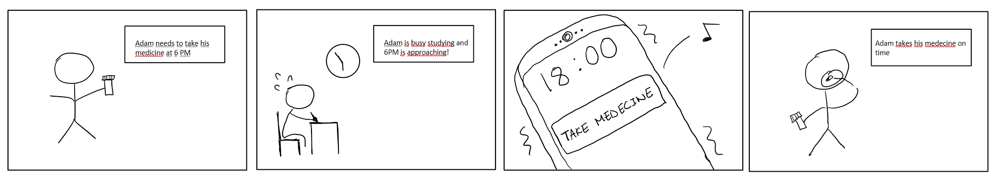
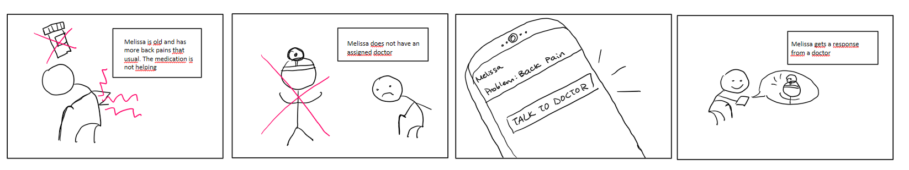
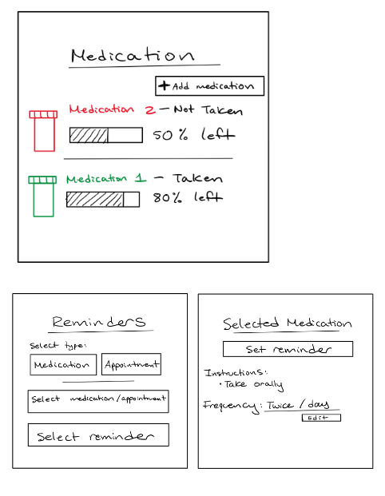
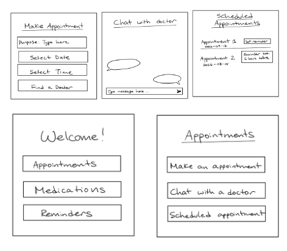
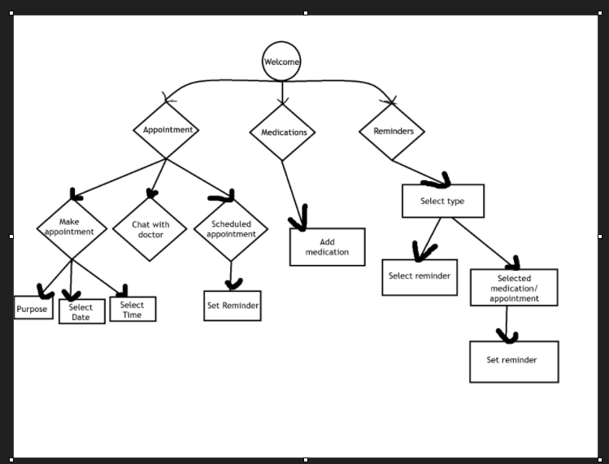
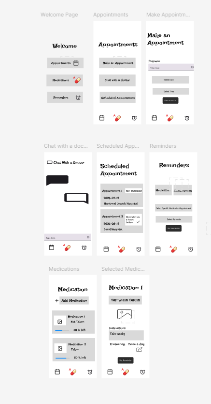

Text can be **bold**, _italic_, or ~~strikethrough~~.

[Link to another page](./another-page.html).

There should be whitespace between paragraphs.

There should be whitespace between paragraphs. We recommend including a README, or a file with information about your project.

# TABLE OF CONTENT

1. Introduction
2. Research
2.1 Survey
2.2 Findings
3. Personas
4. User journey Mapping
5. Storyboards
6. Sketches
7. User Flow Diagram
8. Wireframes
9. Prototypes
10. Usability
11. Reflection

# 1. Introduction

* * *
This blog focuses on the UX/UI design of a health companion app created to support people living and suffering from chronic health conditions. The app is designed to help users stay on top of important health-related tasks, such as taking medications on time, scheduling doctor appointments, and communicating with healthcare professionals. While each of these tasks may seem simple on its own, managing them consistently alongside everyday responsibilities can become overwhelming. As a result, individuals may miss medication doses or forget important follow-ups with their doctors.

Research indicates that individuals with chronic health conditions want mobile apps focused on timely reminders and medicine tracker. With this in mind, the proposed app is developed using a structured and user-centered UX/UI design approach to maximize its effectiveness.

The design process starts with user research to better understand the needs, behaviors, and challenges of the target audience, followed by the creation of detailed user personas. A user journey map is then developed to outline key interaction steps and identify potential pain points. From there, low-fidelity wireframes and an interactive prototype are created to demonstrate the app’s functionality and navigation flow. Finally, a usability testing plan is implemented to evaluate the design, along with a reflection on the challenges encountered and lessons learned throughout the process.

## 2. Research
* * *

### 2.1 Survey
* * *
For the purpose of this research, a small survey was provided for individuals suffering from chronic health conditions. Here was a summary of the questions asked and their results:

> _Do you suffer from a chronic disease, if so, which one?_

*   Hypertension
*   Depression, Anxiety
*   Diabetes
*   Breast Cancer
*   AIDS
*   Anaemia and hypertension
*   Diabetes Type 1
*   Anxiety, Diabetes, back pain
*   Yes, I suffer from epilepsis.
*   Yes I have, chronic liver disease due to high rate of creatine.
*   Alzheimer's

> _Do you need to take medecine? If so, at what frequency?_

> _Do you have any issue with your medication, e.g: such as forgetting to take it , taking the wrong one, etc?_

Most popular answer:

*   Forget to refill medication
*   Confused between the consumption of multiple pills
*   No issues
*   Forgot to take pills
*   Taking wrong pill
*   Don’t want to take it

> _Do you have regular doctor checkup? If so, at what frequency?_

> _Do you have any issue with doctor appointment? e.g: Finding a doctor, forgetting doctor appointment ,etc._

*   Finding a doctor
*   Forgetting a doctor appointment
*   No issues
*   Forgot if the appointment was made

> _If there was an app built to help you, what would be one feature that you will absolutely need?_

*   Tracking appointment
*   Help motivate me take my medication
*   Helping me connect to a healthcare professional
*   Sending me reminders that my appointment is coming up
*   Helping me finding a doctor fast
*   Helping me keep track of the medication I need to take daily
*   Reminders
*   Helping me figure out which medication to take.
*   Remind me to get a refill.
*   Nothing really
*   Help remind me of my appointments and keep track of my medication intake

### 2.2 Findings
* * *

According to the survey , here is the main points to focus on:

1.  Appointment tracking/reminders
1.  Medecine intake reminder / refill reminders
1.  Easy communication with healthcare professional
1.  Managing multiple medication

These are the main points to be focused on. Furthermore, an anonymous statistic also show the range of people affected and a lot of the individual are over the age of 60. With that in mind, another set of criteria has been added.

* Simple navigation
* Ease of use
* Simple interfaces

## 3. Personas
* * *

Here are two personas created for this UX/UI design:

*Adam*

The first persona is Adam. Adam is young and works a lot. He has hypertension and diabetes and due to his work environment, often forgets to take his medication or which medication was already taken. This might cause serious issues if not corrected fast enough. That's why for Adam, this app will help him be on top of his medication with reminders and also track which medication he has already taken. It is important to be noted that Adam also is good with technology

Goal: 

- Not miss medication timing
- Track medication intake

Motivation:

- Help overall health
- Do not worsen condition

Pain points: 

- Forgetting to take medication at dedicated time
- Forgetting which medication was taken

*Melissa* 

On the other hand, the second persona is Melissa. Melissa is old and suffers from back pain and diabetes. She often forgets to go to the appointment with the doctor for her conditions which may cause them to worsen. On some nights, her back pain worsened and she needs a way to easily talk to a doctor.  That’s why Melissa needs to use this app. It will help her set reminders for her medical appointment as well has having an easy way to contact her health professional. It is also important to note that Melissa is not tech-savvy and would prefer a simple app.

Goal: 

- Not miss medical appointment
- Easily chat with doctors

Motivation:

- Help relieve pain
- Do not worsen condition

Pain points: 

- Forgetting to go to appointment due to declining memory
- Unable to reach doctors easily
- Complicating UI on the market

## 4. User Journey Mappings
* * *

*Adam*

*Melissa*

## 5. Storyboards
* * *

Following my two personas, here is a storyboard on how the chronic health app will be used:

The first storyboard illustrates Melissa who is an elderly lady that needs to talk to her doctor because her chronic back pain is getting worse. Unfortunately , her doctor is not available. Here is where the app comes into play where Melissa can talk to a doctor whom he is going to have a good history of Melissa's condition and from there , he might be able to give good advice for Melissa to help relieve her pain or he can schedule an appointment with Melissa.

The second storyboard illustrates Adam who is a busy man that needs to take his medication at a specific time of the day. However, due to his stressful work, he often gets drowned into work and forgets that it's time to take his medicine. Here is where the app comes into play, the app will set off an alarm pre-arranged by Adam. Adam will them be reminded to take his medicine at the right time.

## 6. Sketches
* * *

## 7. Userflow
* * *

## 8. Wireframes
* * *
Link: https://www.figma.com/proto/B5BRHYCrs8D4XHVyshdnxB/Chronic-Health-App?node-id=2-5&t=npWb2sVUbhg4aKh7-0&scaling=scale-down&content-scaling=responsive&page-id=0%3A1

## 9. Prototype
* * *
Link: https://www.figma.com/proto/B5BRHYCrs8D4XHVyshdnxB/Chronic-Health-App?node-id=1-104&p=f&t=npWb2sVUbhg4aKh7-0&scaling=min-zoom&content-scaling=fixed&page-id=1%3A104&starting-point-node-id=26%3A3426

This is my final mockup for the prototype. The interface is made in mind for my persona that is not tech savvy. It is easy to navigate with clear concise information that is not too overwhelming for the user.  It also completes the needs of both my personas. The app has a page to book an appointment, chat with a doctor or see scheduled appointments . They can also set reminders for medication as well as appointments. On the medication side, the persona is able to view how much medication is left and if he has taken it or not. This can be distinguished by the distinct color feedback of when it is taken, green and when it is not , red. 

## 10. Usability Testing
* * *

*Goals:*

- See if the app setup is intuitive to the user in how to navigate to the different tabs, set medications,etc.
- Validate the effectiveness and clarity of the reminders.
- Validate the ease of getting into a contact with a medical professional.

*User tasks:*

- Make an appointment
- Chat with doctor
- Set reminder for appointment
- Set reminder for medicine
- Add new medicine
- Confirm taking the medicine.

*Feedback Collection:*

- Verbal/Think Aloud Feedback
- Questionnaire
- Time of completion of task

*Analysis:*

The feedback will be taken into account and the issues that are going to be brought up the most are going to be prioritized for future iterations.

## 11. Reflection

The UX design helped me understand and identify user needs through user journey maps, pain points, questionnaires and personas.Mainly through pain points, I was able to put myself in the shoes of a persona suffering from chronic health issues and adapt the app to benefit them. The focus on the app was put in quick, easy and reassuring experience for the user.

The main challenge of this design process was to balance the app so that it was simple enough for a non tech savvy persona and elderly persona but still remains with all the desired functioanlity. It was overcome by simple layout and color feedback which is proof of a simplified workflow. 

